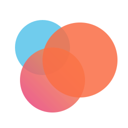
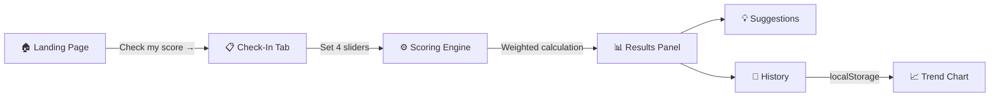
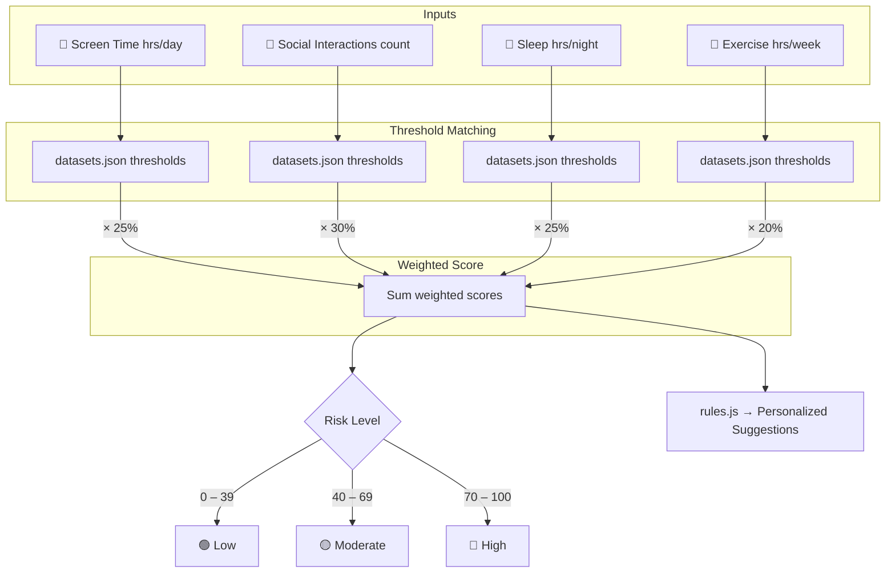

<div align="center">
  <br />
  

  # LonelyLess

  **A research-backed loneliness risk assessment tool with a premium, editorial UI.**

  🚀 **[Try it Live →](https://lonely-less-theta.vercel.app/)**

  <br />

  <p>
    
    
    
    
  </p>

  <p>
    
    
    
    
  </p>

</div>

---

## ✨ What is LonelyLess?

LonelyLess takes **4 simple lifestyle inputs** and produces a **0–100 loneliness risk score** grounded in published studies from the **UCLA Loneliness Scale**, **WHO Digital Wellness Guidelines**, and the **NIH Sleep Research Database**.

> 💡 No account. No personal data. No server calls. Just an honest score in **30 seconds**.

---

## 🎯 Key Features

| Feature | Description |
|---|---|
| 🧠 **Research-Backed Scoring** | Weighted algorithm based on UCLA, WHO & NIH thresholds |
| 🎨 **3 Premium Themes** | Mental Health (clinical teal), Deep Ocean (dark navy), Tangerine (energetic citrus) |
| 💧 **View Transitions API** | A ripple "water droplet" animation bursts from your cursor on theme switch |
| 📊 **SVG Score Rings** | Beautiful, pure inline SVG radial progress — zero chart libraries needed |
| 📜 **Check-In History** | All scores persisted in `localStorage` with visual trend tracking |
| 🔒 **Privacy-First** | Everything runs client-side. Your data never leaves your browser |
| 📱 **Fully Responsive** | Optimized for mobile, tablet, and desktop viewports |

---

## 🧪 The Science Behind the Score

LonelyLess measures **four lifestyle factors** that peer-reviewed studies have most strongly linked to loneliness and social isolation:

```
┌──────────────────┬────────┬─────────────────────────────────┐
│ Factor           │ Weight │ Source                          │
├──────────────────┼────────┼─────────────────────────────────┤
│ 📱 Screen Time   │  25%   │ WHO Digital Wellbeing 2023      │
│ 🤝 Social Life   │  30%   │ UCLA Loneliness Scale 2020      │
│ 🌙 Sleep Quality │  25%   │ NIH Sleep Deprivation Research  │
│ 🏃 Exercise      │  20%   │ WHO Physical Activity 2022      │
└──────────────────┴────────┴─────────────────────────────────┘
```

Each factor is scored against research-defined thresholds, then combined using a weighted formula to produce a final risk level: **Low** (0–39), **Moderate** (40–69), or **High** (70–100).

---

## 🎨 Theme Engine

A zero-dependency **Matugen-style theme engine** is baked into the architecture. Switch between three handcrafted wellness palettes with a stunning View Transitions API ripple effect:

| Theme | Vibe | Background |
|---|---|---|
| 🩺 **Mental Health** | Clinical teal & warm slate | `#f4f7f6` |
| 🌊 **Deep Ocean** | Rich navy & sky-blue twilight | `#0b1120` |
| 🍊 **Tangerine** | Energetic high-contrast citrus | `#fff7ed` |

> The ripple animation expands as a circular clip-path from your exact cursor position, creating a "drop in the ocean" effect.

---

## 📈 How It Works — Workflow

### Application Flow



### Scoring Pipeline



### Suggestion Engine

The suggestion engine (`rules.js`) fires **threshold-based rules** per factor. When a factor score exceeds its trigger threshold, relevant actions are surfaced, sorted by urgency priority, and capped at the top 4 most impactful recommendations.

---

## 🏗️ Project Architecture

```
wellbeing-checker/
├── public/
│   ├── logo.svg
│   ├── favicon.svg
│   └── icons.svg
├── src/
│   ├── App.jsx                 # Lightweight client-side router
│   ├── LonelyLessLanding.jsx   # Editorial marketing/landing page
│   ├── LonelyLess.jsx          # Core check-in application
│   ├── ThemeProvider.jsx        # Theme context + View Transitions API
│   ├── ThemeSlider.jsx          # Theme palette switcher component
│   ├── components/
│   │   ├── CheckInTab.jsx       # Input sliders for the 4 factors
│   │   ├── ResultsPanel.jsx     # Score ring + risk breakdown
│   │   ├── HistoryTab.jsx       # Historical check-in list
│   │   ├── HistoryItem.jsx      # Individual history entry
│   │   ├── FactorGrid.jsx       # Factor breakdown cards
│   │   ├── Header.jsx           # App header with navigation
│   │   ├── Slider.jsx           # Reusable range slider
│   │   ├── SuggestionList.jsx   # Personalized action suggestions
│   │   └── charts/
│   │       └── HistoryChart.jsx # Trend visualization
│   ├── hooks/
│   │   └── useHistory.js        # localStorage persistence hook
│   ├── utils/
│   │   ├── scoring.js           # Weighted risk calculation engine
│   │   └── rules.js             # Threshold-based suggestion rules
│   └── data/
│       └── datasets.json        # Research-based scoring thresholds
├── index.html
├── vite.config.js
├── vercel.json                  # SPA rewrite rules for Vercel
└── package.json
```

---

## 🚀 Getting Started

### Prerequisites

- **Node.js** ≥ 18
- **npm** ≥ 9

### Installation

```bash
# Clone the repository
git clone https://github.com/void1x/LonelyLess.git

# Navigate to the project
cd LonelyLess

# Install dependencies
npm install

# Start the dev server
npm run dev
```

Open [http://localhost:5173](http://localhost:5173) to view it in your browser.

### Build for Production

```bash
npm run build
npm run preview
```

---

## 🌐 Deployment

LonelyLess is deployed on **Vercel**. The included `vercel.json` handles SPA routing rewrites so all paths are served through `index.html`.

> **Live URL:** [https://lonely-less-theta.vercel.app/](https://lonely-less-theta.vercel.app/)

---

## 👥 Contributors

<table>
  <tr>
    <td align="center">
      <a href="https://github.com/void1x">
        
        <br />
        <sub><b>Shashi Singh</b></sub>
      </a>
      <br />
      <sub>💻 Fullstack Dev & Bug Fixes</sub>
    </td>
    <td align="center">
      <a href="https://github.com/cham17R">
        
        <br />
        <sub><b>Cham Myae Min Thu</b></sub>
      </a>
      <br />
      <sub>🎨 UI/UX Design</sub>
    </td>
    <td align="center">
      <a href="https://github.com/rushii15x">
        
        <br />
        <sub><b>Rushi Rajviya</b></sub>
      </a>
      <br />
      <sub>🚀 Deployment & QA</sub>
    </td>
  </tr>
</table>

---

## 📚 Research References

- **Holt-Lunstad et al., 2015** — Social isolation linked to 26% higher mortality risk
- **UCLA Loneliness Scale, 2020** — 61% of adults report feeling lonely
- **WHO Digital Wellbeing, 2023** — 23% loneliness increase above 5 hrs/day screen time
- **NIH Sleep Research** — 35% higher depression risk from irregular sleep

---

## 🔐 Privacy

LonelyLess is **100% client-side**. All check-in data is stored exclusively in your browser's `localStorage`. No analytics. No tracking. No server. Your data stays yours.

---

<div align="center">
  <br />
  
  <br />
  <em>Designed for connection, privacy, and mindful introspection.</em>
  <br />
  <sub>© 2025 LonelyLess · Built with ❤️ and open research data</sub>
  <br /><br />
</div>
