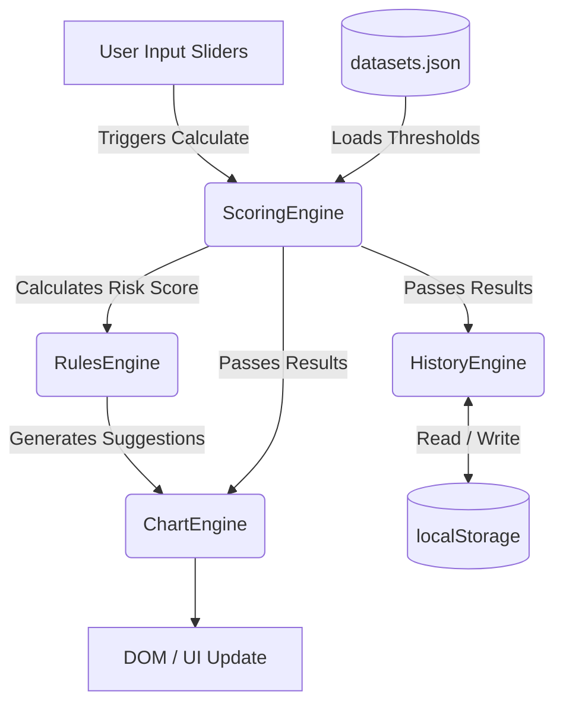

# 🧠 LonelyLess

[](https://developer.mozilla.org/en-US/docs/Web/JavaScript)
[](https://tailwindcss.com/)
[](https://www.chartjs.org/)
[](https://opensource.org/licenses/MIT)

> **LonelyLess** is a lightweight, client-side web application designed to help users quantify, track, and improve their digital, social, and physical wellbeing. 

By evaluating four key lifestyle factors (screen time, social interaction, sleep, and physical activity) against globally recognized health standards (WHO, NIH, UCLA), LonelyLess provides personalized risk assessments and actionable recommendations to combat loneliness and improve overall mental health. 

No backend, no accounts, zero tracking — your data stays in your browser.

---

## 📑 Table of Contents

- [✨ Core Features](#-core-features)
- [🏗️ Architecture & Data Flow](#-architecture--data-flow)
- [📂 Codebase Structure](#-codebase-structure)
- [🧩 Module Deep Dive](#-module-deep-dive)
  - [ScoringEngine](#1-scoringengine-jsscoringjs)
  - [RulesEngine](#2-rulesengine-jsrulesjs)
  - [HistoryEngine](#3-historyengine-jshistoryjs)
  - [ChartEngine](#4-chartengine-jschartsjs)
- [🚀 Getting Started](#-getting-started)
- [🔧 Customization](#-customization)
- [🛠️ Tech Stack](#-tech-stack)
- [📝 License](#-license)

---

## ✨ Core Features

- **4-Factor Risk Assessment:** Evaluates daily habits across Screen Time, Social Events, Sleep Duration, and Physical Activity.
- **Evidence-Based Scoring:** Utilizes dynamic thresholds weighted against clinical guidelines (WHO, NIH).
- **Intelligent Recommendations:** A built-in Rule Engine triggers targeted lifestyle interventions based on specific risk factors.
- **Rich Visualizations:** Interactive doughnut (score ring), radar, and timeline charts powered by Chart.js.
- **Local Persistence:** Securely stores up to 30 historical check-ins using HTML5 `localStorage`.
- **Zero-Dependency Architecture:** Pure Vanilla JavaScript, HTML, and CSS. (Tailwind and Chart.js are loaded via CDN).

---

## 🏗️ Architecture & Data Flow

LonelyLess relies on a strictly unidirectional, globally-namespaced engine architecture. 



---

## 📂 Codebase Structure

```text
lonelyless/
├── index.html          # Core view, UI orchestration, and DOM event bindings
├── css/
│   └── style.css       # Custom animations, slider overrides, and color utilities
├── js/
│   ├── scoring.js      # Core business logic: calculates weighted risk scores
│   ├── rules.js        # Recommendation logic: maps scores to actionable advice
│   ├── history.js      # Persistence layer: manages localStorage CRUD operations
│   └── charts.js       # Visualization layer: Chart.js wrappers and renderers
└── data/
    └── datasets.json   # Configuration: Scoring thresholds, weights, and labels
```

---

## 🧩 Module Deep Dive

### 1. `ScoringEngine` (`js/scoring.js`)
Responsible for quantifying raw input into actionable metrics. 
- Loads `datasets.json` asynchronously on startup.
- Normalizes individual factor inputs against predefined threshold arrays (`min/max`).
- Calculates the weighted **Total Risk Score (0-100)** and determines the overall risk bracket (Low/Moderate/High).
- **Note on Sleep:** Sleep logic is uniquely bidirectional. The engine naturally handles penalties for both sleep deprivation (< 7 hrs) and oversleeping (> 9 hrs) strictly through ordered dataset arrays.

### 2. `RulesEngine` (`js/rules.js`)
An intelligent evaluation matrix that provides personalized feedback.
- Contains a declarative array of `RULES`.
- Evaluates the output from the `ScoringEngine`. 
- Returns an array of contextual, actionable suggestions sorted by urgency (`priority`). If a user has a highly sedentary lifestyle, the most urgent physical activity recommendations surface first.

### 3. `HistoryEngine` (`js/history.js`)
The storage controller ensuring data privacy.
- Interacts strictly with `localStorage`.
- Enforces a rolling FIFO (First-In-First-Out) buffer capped at **30 entries**.
- Prepares and formats chronological arrays (`getHistoryChartData`) to be consumed by the Line Chart in the history tab.

### 4. `ChartEngine` (`js/charts.js`)
A decoupled visualization wrapper for `Chart.js`.
- Custom plugin: `centerTextPlugin` injects dynamic text into the Doughnut chart.
- Dynamic Radar context: Radar chart dynamically updates its border and fill colors based on the single highest-risk factor to naturally draw the user's eye to problem areas.
- Lifecycle management: safely destroys and re-initializes canvas contexts to prevent memory leaks during history updates.

---

## 🚀 Getting Started

LonelyLess requires no build pipeline, Node.js, or package manager. However, because it fetches `datasets.json` via the native `fetch()` API, it **must be served over a local HTTP server** (to bypass CORS `file://` restrictions).

**Option A: Using Python (Mac/Linux/Windows)**
```bash
cd lonelyless
python -m http.server 8080
# Open http://localhost:8080 in your browser
```

**Option B: Using Node.js**
```bash
npx serve .
# Open http://localhost:3000 in your browser
```

**Option C: VS Code**
1. Install the [Live Server](https://marketplace.visualstudio.com/items?itemName=ritwickdey.LiveServer) extension.
2. Open `index.html`.
3. Click "Go Live" in the bottom right corner of VS Code.

---

## 🔧 Customization

LonelyLess is designed to be highly modular. You can alter the app's behavior entirely without touching the JavaScript logic.

| To Change... | Edit This File |
|---|---|
| **Scoring logic, weights, clinical thresholds** | `data/datasets.json` |
| **Recommendation text, priorities, icons** | `js/rules.js` (The `RULES` array) |
| **Risk level color palettes (Green/Amber/Red)** | `js/scoring.js` (in `calculateRisk`) |
| **Maximum number of saved history entries** | `js/history.js` (`MAX_ENTRIES` constant) |
| **Layout, typography, structural styling** | `index.html` (via Tailwind utility classes) |

---

## 🛠️ Tech Stack

- **Markup:** HTML5
- **Styling:** [Tailwind CSS v3](https://tailwindcss.com/) (loaded via CDN for layout) + Vanilla CSS (`style.css` for custom range sliders/animations)
- **Logic:** Vanilla JavaScript (ES6)
- **Data Visualization:** [Chart.js 4.4.0](https://www.chartjs.org/) (loaded via CDN)
- **Data Persistence:** Browser `localStorage` API
- **Data Format:** JSON Configuration

---

## 📝 License

Distributed under the MIT License. See `LICENSE` for more information.

---
*Built to make the digital world a little less lonely.*
